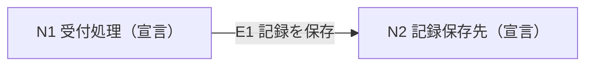

# 表現と一次資料

## 表現の選び方

要素と接続の棚卸しには単純な有向グラフで足りる。通信の順序が主題なら時系列図、配置が主題なら配置図へ分ける。製品固有の記号を採用するために、証拠のない機器や階層を追加しない。

Mermaidを使う場合、以下は文字ラベル付きの要素と有向接続の最小例である。これは架空の宣言構成であり、特定システムの実態を表さない。

外部クリック先、埋め込みの処理、独自拡張は不要なら入れない。ラベルを出力形式に合わせて安全にエスケープする。構文検証に通った後も、接続方向と台帳を照合する。

## 一次資料

- [Mermaidのフローチャート構文](https://mermaid.js.org/syntax/flowchart.html): 要素、接続、向き、文字ラベルの公式仕様。2026-10-02に参照先を確認。使う機能の対応状況は実行時の描画環境で改めて確認する

この参照先は描画構文の根拠である。利用者のシステムの構成や稼働状態を証明する資料ではない。
