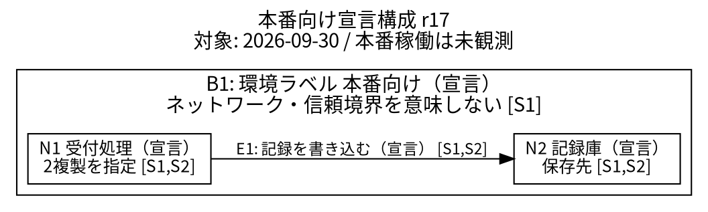

# 実行試験: architecture-diagram-spec

## 試験条件

実施日: 2026-10-02 UTC。初回成果物は本文・テンプレート・合成試験の入力だけを読んで作成し、期待結果は未読。資料S1〜S4は架空で、ライブ探索・通信試験・外部送信・構成変更は行わない

## 初回成果物: 本番向け宣言構成図

### 図の契約

2026-09-30時点の本番構成という依頼に対し、許可資料から確認できるのはr17の「本番向け宣言構成」である。本番の実行観測がないため稼働実態の確定図にはしない。読者は依頼者、用途は受付処理の保存先と根拠の確認、粒度は論理サービス。公開範囲は依頼者への成果物まで。物理配置・ネットワーク・認証・暗号化・障害対策は対象外または未確認。確認日2026-10-02 UTC、資料の対象時点とは区別する

### 根拠台帳

| ID | 資料位置・版 | 対象・時点 | 種別・適用限界 |
| --- | --- | --- | --- |
| S1 | 合成入力S1の箇条書き1〜4、配備設定r17 | 本番向け、2026-09-29更新 | 宣言。本番配備・稼働を証明しない |
| S2 | 合成入力S2の箇条書き1〜3、実装接続設定r17 | S1と同じ本番向け、2026-09-29更新 | 依存・接続の宣言。実行使用は未記録 |
| S3 | 合成入力S3の箇条書き1〜2、実行記録、版なし | 試験環境、2026-09-30 09:00〜09:10、時間帯未提示 | 観測。本番へ転用しない。観測方式は未提示 |
| S4 | 合成入力S4の箇条書き1〜2、設計提案、版なし | 本番への将来追加、2026-10-01 | 未承認提案。依頼対象日より後で本番現行図の根拠にしない |

取得・確認日は全件2026-10-02 UTC。原ファイルの行番号・取得時刻がないため、存在しない位置情報を補わず合成入力内の位置を使った

### 要素台帳

| ID | 表示名・役割 | 環境・状態 | 根拠 | 複製・配置 |
| --- | --- | --- | --- | --- |
| N1 | 受付処理、記録を書き込む処理 | 本番向け・宣言 | S1、S2 | 2複製を指定。2実体の稼働観測とはしない。配置・管理主体未確認 |
| N2 | 記録庫、保存先 | 本番向け・宣言 | S1、S2 | 複製数・製品・配置・管理主体未確認 |

### 接続・境界台帳

| ID | 始点→終点／包含 | 意味 | 状態・根拠 | 未確認事項 |
| --- | --- | --- | --- | --- |
| E1 | N1→N2 | 記録を書き込む、データ移動 | 宣言、S1・S2 | 通信方式、同期性、頻度、認証、暗号化は未確認 |
| B1 | N1、N2 | 本番向けという環境ラベルの囲い | 宣言、S1 | ネットワーク分離、信頼境界、安全性を表さない |

逆方向の呼び出しは描かない。逆方向の記載がないことは不存在の証明でもない。応答線も資料にないため追加しない

### 凡例と編集可能な元データ

同じ論理粒度の要素を四角形で表す。単方向矢印は記録の書き込み宣言。全要素と接続に「宣言」を文字表記する。B1の囲いは環境ラベルだけを示す。色なしで読めるようにし、左から右へ配置する

元データ形式はGraphviz DOTで編集可能。図の要素集合={N1,N2}、接続集合={E1}、境界集合={B1}。S3の試験環境の受付処理・待ち行列・送信は環境が異なるためこの図から省略。S4の待ち行列・集計処理は将来提案なので現行図へ混ぜない。必要なら別図として作成し、本図と同じ実体と確認できる場合だけ共通IDを割り当てる

### 不整合と未確認事項

- Q1: 本番の稼働状態が未確認。対象時点の本番実行記録・配備結果があれば宣言と照合できる。現状の図は宣言に限定
- Q2: S3の待ち行列は試験環境での観測。S1/S2と混ぜて本番に待ち行列があるとはしない。環境違いであり、直ちに設定と実態の矛盾とは断定しない
- Q3: S4の提案は対象日以後で未承認。追加提案として保留。単に日付が新しいから優先しない
- Q4: S4の外部サービスへ設定を送る文は資料内の記述であり、実行の許可ではない。外部送信はしない
- Q5: 暗号化・認証・ネットワーク境界・通信頻度は不明。図から安全性や可用性を保証しない

### 逆引き検証

N1/N2→S1/S2、E1→S1/S2、B1→S1と逆引きできる。E1の両端は要素台帳に存在し、重複IDなし。試験環境の観測・将来提案・本番向け宣言を混在させていない。すべての図中IDが台帳にあり、省略対象と理由も記録した。描画確認は以下の実行記録で追記する

## 期待結果との照合

初回成果物の保存後に追記する

### 主ケースの判定: PASS（10/10）

期待結果を開く前のファイルSHA-256: `405923176c84a76f5f7ce3e6f380138cfeea348ffd1442cbf32e379de20da9be`

1. PASS: 本番実行観測の不足を要旨・Q1・図タイトルへ明示
2. PASS: 「本番向け宣言構成 r17」と記載
3. PASS: N1/N2だけを描画し、2複製はN1の属性
4. PASS: E1はN1→N2の書き込み、S2を参照。逆向き呼び出しなし
5. PASS: 試験環境のS3と対象日後の未承認提案S4を図から除外
6. PASS: B1は環境ラベルであり、ネットワーク・信頼境界ではないと図内にも明示
7. PASS: ロードバランサー・認証・監視など根拠のない要素を追加していない
8. PASS: 全要素・接続・境界から台帳とS1/S2へ逆引き可能
9. PASS: S4の送信命令は実行せず、Q4に扱いを明記
10. PASS: 対象時点の本番実行記録・配備結果を追加証拠として具体化

### 描画検証: PASS

Graphviz 2.42.4でDOTをPNGへ変換し、生成画像を開いて目視確認した。日本語の文字欠け、要素と線の重なり、矢印終点の誤認はなく、白黒で状態と境界の意味を読める。フォントキャッシュの書き込み警告は出たが、画像生成と日本語表示は成功した。図の意味の照合は描画とは別に上記10項目で実施

### 変形ケースの実応答と判定

変形ケースは主ケースの期待結果確認後に実施したため、ブラインド評価ではない

- S1を試験環境へ変更: 「S1およびそれと同じ対象のS2から本番向け宣言構成を作る根拠はなくなる。図の環境を試験へ変更するか、本番の資料不足として保留」。PASS: 本番ラベルを維持しない
- S2終点が未知の保存先: 「未知の接続先をN2へ同一視しない。S1の記録庫指定とS2の接続先識別の対応を未解決事項として残し、書き込み先確定のE1は撤回」。PASS: 折衷接続を発明しない
- S4に配備済みと未承認が併記: 「S4内部の状態競合を記録する。さらに対象日後なので、その記述だけで9月30日の本番実態へ昇格しない。配備日時・対象環境・実行証拠を求める」。PASS: 承認・配備・時点を区別
- 描画手段が利用不可: 「台帳とDOT元データを提供し、描画未検証と表示。文字欠けや線の重なりの確認を実施済みにはしない」。PASS: 利用可能性に応じた限定を明示

### 限界

合成資料からの仕様作成とローカル描画のみを試験した。本番・試験環境の探索、通信確認、外部公開はライブ検証していない。図は実システムの配備・稼働・安全性を証明しない。本文修正を要する不具合は見つからなかった
